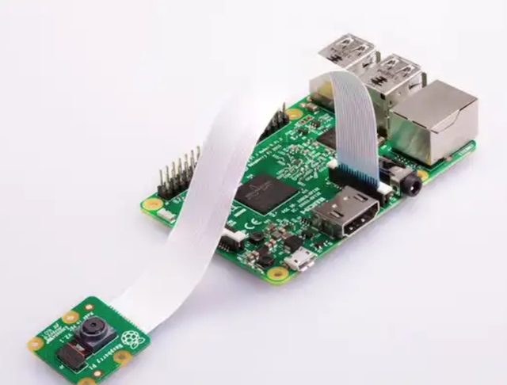
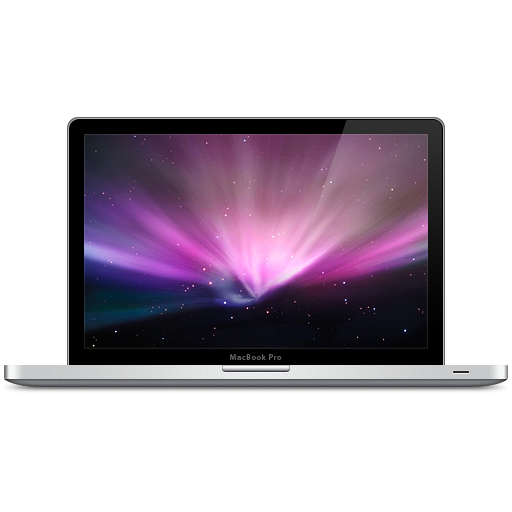

# Multi-Camera Capture and Viewer

This repository contains a toolkit to build dataflow pipelines for recording and processing images 
from RaspberryPi cameras, sending them over a network, and a video viewer tool that can display 
image streams from multiple sources at once.

## Demo

A simple setup would consist of the following devices:

<table>
    <tr>
        <td width="33%"></td>
        <td width="33%"></td>
        <td width="33%"></td>
    </tr>
    <tr>
        <td align="center">pi-cam01</td>
        <td align="center">pi-cam02</td>
        <td align="center">laptop</td>
    </tr>
</table>

To run the system, first start the cameras running on each of `pi-cam01` and `pi-cam02`. You will need
to install the software and configure the systems (documentation coming), and once that
is done, simply run this command on each raspberry-pi with the cameras:

    $ ./camera/ck-run cameras/configs/zenoh/zenoh.yaml

On the laptop, once you have built the `multiview` application (documentation coming), you can view the images by
running this command:

    $ ./multiview/build/multiview home/pi-cam01/image home/pi-cam02/image

The applications use a technology called [zenoh](https://zenoh.io/) to communicate. You just need to
make sure the computers are all running on the same network, and if you provide the correct logical
locations of the image servers, then `multiview` will find them itself - no need to specify IP addresses and
ports.

This will result in displaying two image streams side by side as shown in the screen capture below:

The `mulitview` window is shown here as it appears on a Mac. The application is cross platform and can be built
and run on a RaspberryPi and Windows as well.

## Tools

### Camera Toolkit

* [Setup and Usage Instructions](docs/build-camera.md)
* [The Details](docs/details-camera.md)

### Multiview

* [Build and Usage Instructions](docs/build-multiview.md)

